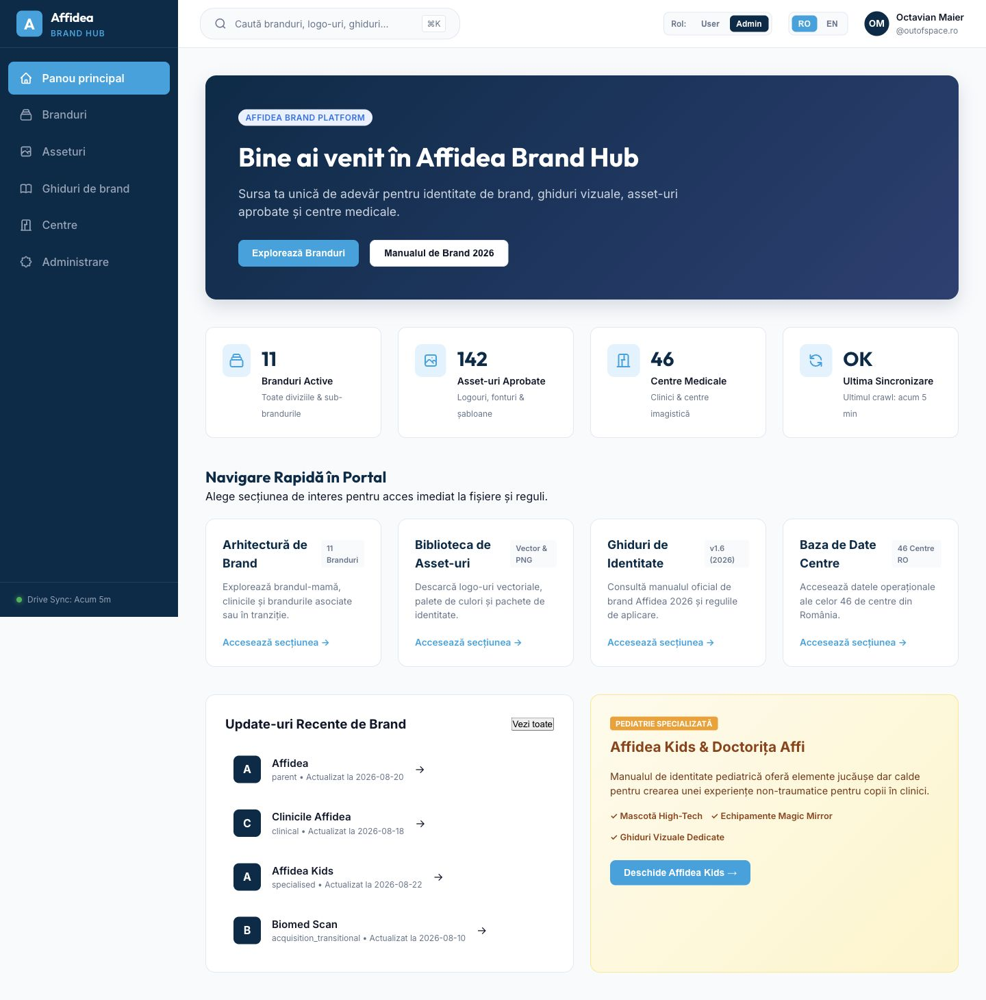
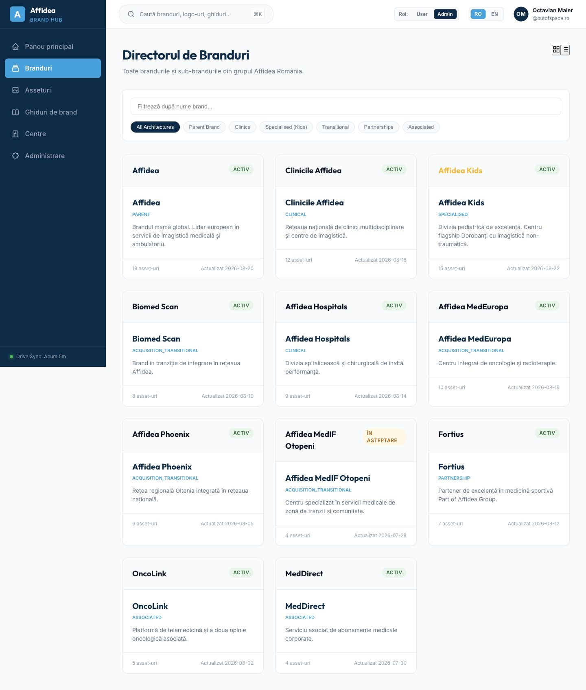
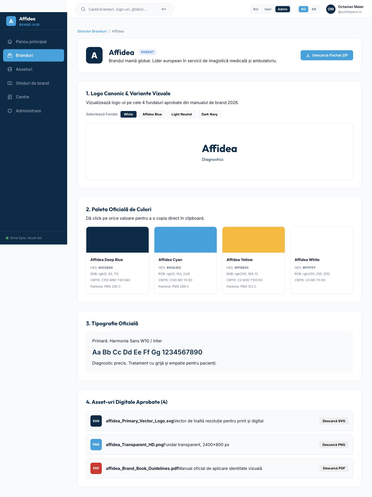
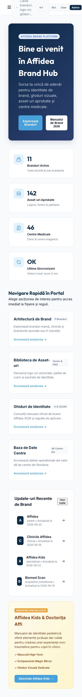

# Affidea Brand Hub - audit de brand, UX si implementare

Data auditului: 24 august 2026

## Verdict

Implementarea actuala este un prototip functional de Phase 1, dar nu este inca un brand hub Affidea credibil. Structura generala este utilizabila, insa identitatea vizuala este bazata pe o paleta necanonica, logo-uri reconstruite din text, iconografie generica si continut simulat. Pagina de brand arata ca un dashboard administrativ, nu ca un brandbook digital.

Prioritatea zero este inlocuirea tuturor reprezentarilor text/initiale cu asset-uri oficiale din Drive si alinierea tokenilor la Affidea Brand Guidelines v1.6 (2026).

## Surse verificate

- toate fisierele Markdown din radacina, `docs/`, `prompts/` si `references/`;
- `IMPLEMENTATION_CHECKLIST.md`;
- implementarea React, CSS, fixtures, design tokens si Worker;
- Google Drive, root `16hA1bCXCEQxRtWbNWC6apAZDPH7fW8sE`;
- manualul canonic `Affidea_Brand_Guidelines_v1.6_2026_CANONICAL.pdf`;
- capturi noi din build-ul local existent, la 1440 px si 390 px.

## Flux auditat

### 1. Dashboard desktop - stare: necesita redesign major

Puncte bune: navigarea principala este vizibila, ierarhia de baza este usor de urmarit, iar statisticile si quick links sustin orientarea initiala.

Probleme:

- logo-ul din sidebar este o litera `A`, nu asset oficial;
- paleta dominanta foloseste navy/cyan necanonice si face produsul sa para un SaaS generic;
- hero-ul nu foloseste limbajul vizual al copertii oficiale: Affidea Blue, logo alb, forme diagonale translucide si respiratie editoriala;
- cardurile rapide nu au imagini, logo-uri sau iconografie de brand si nu creeaza impresia de biblioteca vizuala;
- spotlight-ul Affidea Kids nu afiseaza nici logo, nici Affi, desi textul promite o experienta vizuala;
- exista amestec de romana si engleza in metadata (`parent`, `clinical`, `acquisition_transitional`).

### 2. Director branduri - stare: structural bun, vizual neacceptabil

Puncte bune: grila, cautarea si filtrarea sunt potrivite pentru inventarul de branduri.

Probleme:

- fiecare card repeta numele brandului in loc sa afiseze logo-ul aprobat;
- toate cardurile au aceeasi greutate si aceeasi suprafata, fara diferentiere intre brand-mama, sub-brand, asociat si tranzitional;
- filtrele sunt in engleza intr-o interfata setata pe romana;
- cardurile sunt `div` clickabile, nu linkuri/butoane semantice;
- badge-urile si metadata au contrast vizual foarte slab;
- data si numarul de asset-uri ocupa spatiu, dar nu raspund la intrebarea principala: "care este identitatea corecta si ce pot descarca?".

### 3. Pagina de brand - stare: blocker de brand si continut

Probleme critice:

- logo-ul canonic este reconstruit din text (`Affidea / Diagnostics`), interzis explicit de documentatie;
- header-ul foloseste din nou initiala `A` in locul logo-ului;
- paleta afisata este gresita: `#002B49`, `#00A3E0`, `#FFB800`, in contradictie cu valorile canonice 2026;
- pagina declara Harmonia, dar randarea foloseste Inter/Outfit; Barriecito este inlocuit cu Outfit fara sa afiseze clar indisponibilitatea;
- randurile de download sunt continut inventat, nu fisierele si numele reale din Drive;
- randurile de download se lipesc textual la desktop si nu au suficienta separare intre titlu si descriere;
- lipsesc sectiunile cerute de specificatie: overview, guidelines real, digital assets, related brands/lockups, exceptii si sursa/canonical status;
- selectorul de fundal nu schimba asset-ul intre varianta full-colour si varianta alba; schimba doar fundalul textului fals.

### 4. Dashboard mobil - stare: blocker responsive

Probleme critice:

- topbar-ul este taiat si suprapus: cautarea, role switcher-ul si controalele ies din viewport;
- user menu si language switcher nu sunt adaptate pentru mobil;
- hero-ul are CTA-uri prea inguste, text spart si densitate excesiva;
- pagina devine foarte lunga deoarece toate blocurile desktop sunt stivuite fara prioritizare;
- meniul hamburger nu are nume accesibil in snapshot;
- rolul de testare `User/Admin` este vizibil ca produs final si consuma latime critica.

## Brand authority - corectii obligatorii

| Element | Implementare curenta | Valoare/abordare canonica |
| --- | --- | --- |
| Primary blue | `#002B49` | `#418FDE` |
| Dark blue | navy custom | `#2D69B3` si `#294074` pentru night |
| Light blue | cyan `#00A3E0` | `#98BFE6` |
| Yellow | `#FFB800` | `#FFC846`, accent rar |
| Typeface | Inter/Outfit | Harmonia Sans W1G, cu fallback `Avenir Next`, Avenir, `Segoe UI`, Arial |
| Logo | text/initiale | SVG/PNG aprobat din Drive |
| Affi | doar text si bife | asset aprobat, folosit rar in dashboard/empty/Kids |
| Guideline viewer | pagina HTML simulata | PDF real, same-origin, cu open/download si metadata |

## Asset-uri oficiale materializate din Drive

Au fost adaugate in `apps/web/public/brand-assets/`:

- `affidea-parent.svg`;
- `clinicile-affidea.svg`;
- `biomed-scan.svg`;
- `affidea-kids.svg`;
- `affidea-kids-white.svg`;
- `affidea-hospitals.svg`;
- `Affidea_Brand_Guidelines_v1.6_2026_CANONICAL.pdf`.

Nu am copiat intreaga biblioteca Drive. Asset-urile trebuie indexate si servite ulterior prin Worker, conform `docs/06_DRIVE_SYNC_ASSETS.md`. Fonturile Harmonia nu trebuie incluse in build pana cand dreptul de web embedding este confirmat.

## Status fata de implementation checklist

| Faza | Status observat | Gap principal |
| --- | --- | --- |
| Phase 0 | partial | monorepo creat, dar configurarea lint/format/E2E si executia reproductibila nu sunt complete |
| Phase 1 | partial, nu trece exit criteria | rutele exista, dar brand fidelity, responsive, state-uri, i18n si a11y sunt incomplete |
| Phase 2 | neinceput practic | Worker-ul are doar `/api/health`; nu exista Access JWT validation |
| Phase 3 | neinceput | frontend-ul foloseste fixtures, fara D1/read APIs |
| Phase 4 | neinceput | nu exista adapter/sync Google Drive |
| Phase 5 | simulare | preview/download/ZIP sunt alert-uri sau HTML mock |
| Phase 6 | simulare | admin-ul nu are guvernanta server-side |
| Phase 7 | neinceput | lipsesc E2E/a11y/security/performance si runbook verificat |

## Recomandare de redesign

Directia potrivita este un "living brandbook", nu un dashboard cu multe carduri:

1. App shell alb, aerisit, cu logo Affidea real si Affidea Blue ca accent, nu sidebar navy dominant.
2. Dashboard editorial: introducere scurta, cautare principala, brand architecture vizuala si preview-uri reale.
3. Directorul de branduri cu carduri neutre, logo centrat in clear space, tip de arhitectura, disponibilitate pachet si ultima versiune.
4. Pagina de brand cu hero bazat pe logo real, sticky section nav si sectiuni Overview / Logo / Colours / Typography / Guidelines / Assets / Downloads / Related.
5. PDF-ul canonic vizibil ca document real; mock-up-ul HTML trebuie eliminat.
6. Pe mobil: header compact cu hamburger, logo, search icon si user menu; restul controalelor intra in meniuri/sheets.

## Ordinea de implementare recomandata

1. Corectare tokens + font stack + icon system.
2. Introducere registry de asset-uri oficiale si componenta `BrandLogo`.
3. Refactor AppShell/topbar/mobile.
4. Redesign dashboard si director branduri.
5. Rescriere pagina de brand ca brandbook digital complet.
6. Inlocuire PDF mock si alert-uri cu fisiere/actiuni reale.
7. Audit 360/768/1280/1600, keyboard, focus, contrast si reduced motion.

## Limite ale auditului

- Capturile verifica aspectul si o parte din structura DOM, nu conformitatea WCAG completa.
- Nu au fost testate cu screen reader toate rutele.
- Build-ul sursa nu a putut porni cu Vite din cauza modulului nativ Rollup existent in `node_modules`; auditul vizual a folosit build-ul `dist` deja generat.
- Am verificat vizual coperta PDF-ului canonic; continutul complet al PDF-ului necesita un renderer/extractor PDF disponibil in mediul de lucru.
