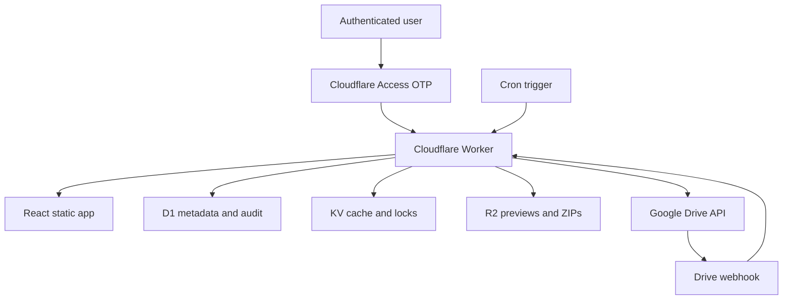

# 04. Technical architecture

## 1. Architecture decision

Use a single TypeScript monorepo deployed to Cloudflare. Cloudflare Access sits in front of `brand.affidea.ro` and owns passwordless email OTP. A Cloudflare Worker serves the API and, preferably, the built frontend static assets. D1 stores governed metadata; KV stores short-lived cache, distributed locks and webhook deduplication; R2 stores private generated previews and ZIP packs. Google Drive remains the source of original files.



## 2. Repository layout

```text
affidea-brand-hub/
  apps/
    web/
      src/components
      src/features
      src/pages
      src/router
      src/styles
      src/i18n
    worker/
      src/api
      src/auth
      src/db
      src/drive
      src/jobs
      src/services
      src/security
  packages/
    contracts/        # shared Zod schemas and TypeScript types
    design-tokens/    # tokens and Tailwind/CSS output
    ui/               # shared accessible components
  migrations/
  scripts/
  tests/
    e2e/
    fixtures/
  docs/
  wrangler.jsonc
  package.json
  pnpm-workspace.yaml
```

## 3. Frontend

- React + TypeScript + Vite.
- React Router with lazy route modules.
- TanStack Query for API caching and mutation state.
- TanStack Table for Data Centres and dense asset/admin tables.
- Zod contracts shared with Worker.
- Tailwind for composition plus semantic CSS variables for brand tokens.
- No direct Drive API calls or credentials in browser code.
- All fetches use same-origin `/api/*` and `credentials: same-origin`.

## 4. Worker API

- Hono routing and middleware.
- Validate `Cf-Access-Jwt-Assertion` signature, issuer, audience and expiry for protected requests.
- Resolve normalized email and user UUID from validated Access identity.
- Load role from D1; default to `user`.
- Use D1 prepared statements and explicit transactions/batches where supported.
- Return problem-details-style errors with a correlation ID.
- Apply authorization at service/query level, not only by hiding frontend controls.

## 5. Storage responsibilities

### D1

Brands, assets, variants, guidelines, centres, roles, tags, translations, approvals, sync cursors/jobs, Drive channels, ZIP manifests and audit events.

### KV

Short-lived API cache, global-search cache, sync lock, webhook deduplication keys, JWK cache and rate-limit counters for expensive endpoints. KV is not the source of truth.

### R2

Generated or fetched preview renditions, PDF thumbnails, approved ZIP packs and optional cached workbook snapshots. Bucket remains private; all user access passes through authorized Worker routes.

### Google Drive

Original binary assets and source documents. The portal stores Drive IDs and metadata, not permanent public links.

## 6. Environments

- Local: Miniflare/Wrangler local D1, KV and R2; fake Access identity only in explicit local mode.
- Staging: separate Access app, D1, KV, R2 and Drive test folder.
- Production: `brand.affidea.ro`, production resources and production Drive root.

Never share D1, R2 buckets, Access audience values or Drive cursors between staging and production.

## 7. Observability

- Structured JSON logs with correlation ID, route, status, duration and sanitized user hash/email where policy permits.
- Do not log centre row bodies, phone numbers, Drive tokens, JWTs or file bytes.
- Sync job dashboards use D1 records, not log scraping.
- Track cache hit, Drive API latency, sync lag, ZIP build duration and error counts.
- Add a `/api/health` endpoint with no secret data; it remains Access-protected in production.

## 8. Performance targets

- Initial shell usable under 2.5 seconds on typical corporate broadband.
- Cached metadata endpoints p95 under 500 ms.
- Search response under 500 ms for the expected dataset.
- Avoid shipping PDF/image binaries in API JSON.
- Use pagination and server-side filtering.
- Stream file downloads; do not buffer large files in Worker memory.
- Use R2 multipart or background workflows for large ZIPs.

## 9. Official implementation references

- Cloudflare Workers overview: https://developers.cloudflare.com/workers/
- Cloudflare D1 binding API: https://developers.cloudflare.com/d1/worker-api/
- Cloudflare D1 migrations: https://developers.cloudflare.com/d1/reference/migrations/
- Cloudflare R2 Workers API: https://developers.cloudflare.com/r2/api/workers/workers-api-reference/
- Cloudflare Cron Triggers: https://developers.cloudflare.com/workers/configuration/cron-triggers/

